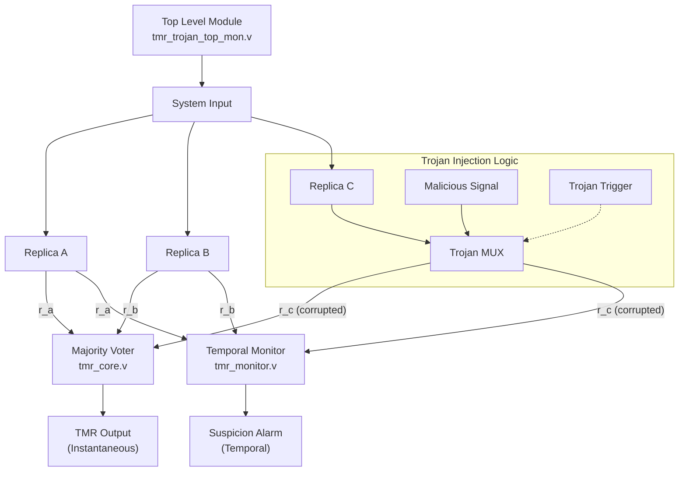
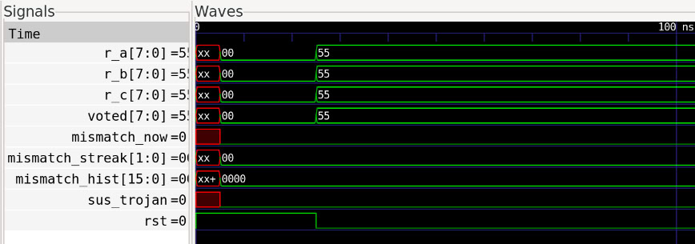
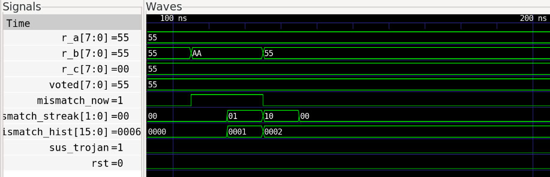
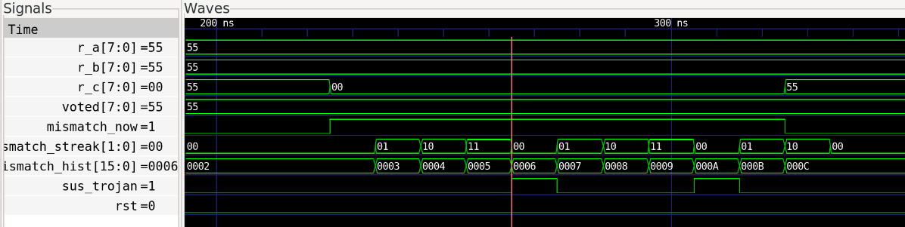

# tmr-hardware-trojan-detection

This project implements and evaluates a **Triple Modular Redundancy (TMR)** system augmented with a **temporal anomaly monitor** to detect stealthy **hardware Trojans** that evade traditional majority voting.

The design is implemented at **RTL level in Verilog** and validated through **simulation and waveform analysis**.

---

## Motivation

Classic TMR systems typically assume that faults are **transient**, **random**, or **isolated to a single replica**.

However, stealth hardware Trojans can violate these assumptions by:
- selectively corrupting outputs,
- activating only under specific conditions, or
- exploiting timing to evade instantaneous majority voting.

Related work has explored hardware Trojan detection using TMR in approximate synthesis contexts.  
This project instead focuses on **temporal behavior analysis at RTL level**, demonstrating that time-domain monitoring can expose stealthy attacks even when instantaneous TMR outputs appear correct.


---

## High-Level Architecture

The design is composed of a conventional TMR datapath augmented with additional monitoring logic:

- **Three redundant data paths** (`r_a`, `r_b`, `r_c`)
- **Bitwise majority voter** (`tmr_core.v`)
- **Trojan-injection logic** (`tmr_trojan_top_mon.v`)
- **Temporal monitor** (`tmr_monitor.v`) that:
  - tracks mismatch history across cycles
  - raises suspicion only after persistent abnormal behavior

---

##Architectural Overview



## Temporal Detection Principle

Instead of reacting to single-cycle mismatches, the monitor observes replica behavior across time:

1. Detects disagreements between redundant replicas  
2. Accumulates mismatch history across cycles  
3. Tracks consecutive mismatches via a streak counter  
4. Raises suspicion only after persistent abnormal behavior  

This enables detection of stealthy Trojans that intentionally evade instantaneous majority voting.

---

## File Overview

| File | Description |
|------|------------|
| `tmr_core.v` | Bitwise majority voter |
| `tmr_monitor.v` | Temporal anomaly monitor |
| `tmr_trojan_top_mon.v` | Top-level design with Trojan injection |
| `tmr_trojan_mon_tb.v` | Simulation testbench |
| `uart_tx_byte.v` | UART transmitter (auxiliary) |
| `uart_rx_byte.v` | UART receiver (auxiliary) |

Generated artifacts (bitstreams, waveforms, synthesis outputs) are intentionally excluded from version control.

---

## Simulation and Evaluation

The design is evaluated using RTL simulation. The testbench injects controlled mismatches to emulate stealthy Trojan behavior that intermittently corrupts one replica.

### Run simulation

```bash
iverilog -g2012 \
  tmr_core.v \
  tmr_monitor.v \
  tmr_trojan_top_mon.v \
  tmr_trojan_mon_tb.v \
  -o tmr_sim.out

vvp tmr_sim.out
gtkwave tmr_trojan_temporal.vcd
```


 ## Toolchain


- Verilog HDL  

- Icarus Verilog  

- GTKWave  

- OSS CAD Suite  


---


## Observed Results


Simulation results show that:


- Instantaneous majority voting continues to produce correct outputs

- Replica mismatches occur intermittently over time

- The temporal monitor accumulates mismatch history correctly

- Persistent abnormal behavior is detected even when no single-cycle fault is sufficient


Waveform inspection confirms that temporal accumulation reveals attacks invisible to purely combinational logic.

## Waveform Evidence (GTKWave)

### 1. System initialization (no anomalies)


### 2. Replica mismatch accumulation (output remains correct)


### 3. Temporal detection trigger



## Key Takeaway


Temporal behavior reveals what instantaneous logic cannot.


Enhancing TMR with lightweight temporal monitoring significantly improves resilience against stealth hardware Trojans without modifying the voting logic itself. 


## Scope & Limitations
This project focuses on RTL-level detection logic and simulation-based validation.
While deployment on a physical FPGA platform was explored, the lack of a compatible board/package combination led to prioritizing architectural evaluation over board-specific integration.
The detection mechanism itself is independent of the target FPGA and can be mapped to suitable platforms when required.
